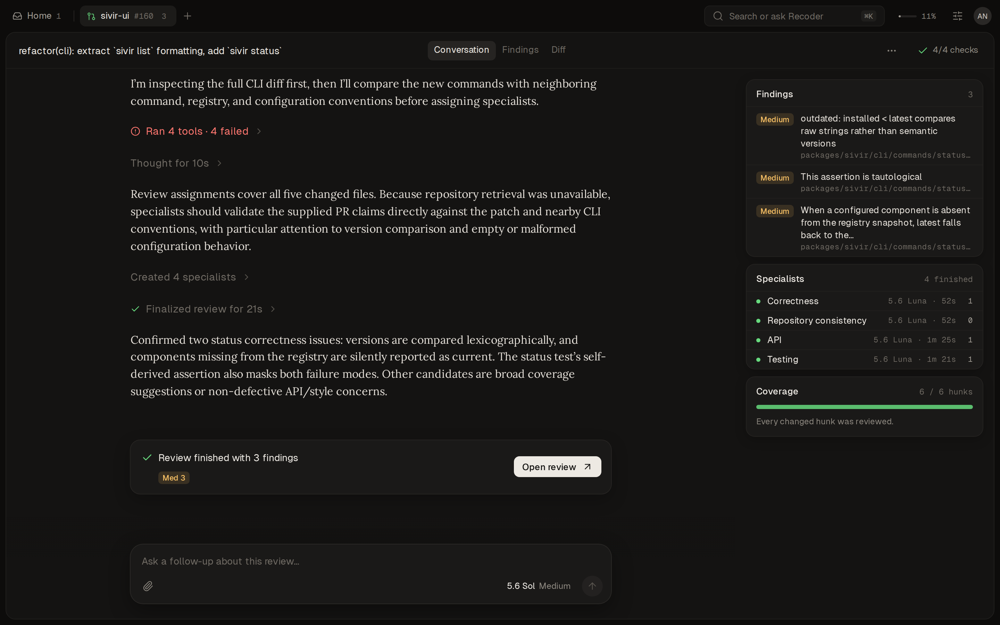

# Recoder

A self-hosted pull request reviewer.



## Run

```sh
bun install
bun run dev
```

Or with Docker:

```sh
cp .env.example .env
docker compose up --build
```

Configuration lives in [`.env.example`](.env.example).
