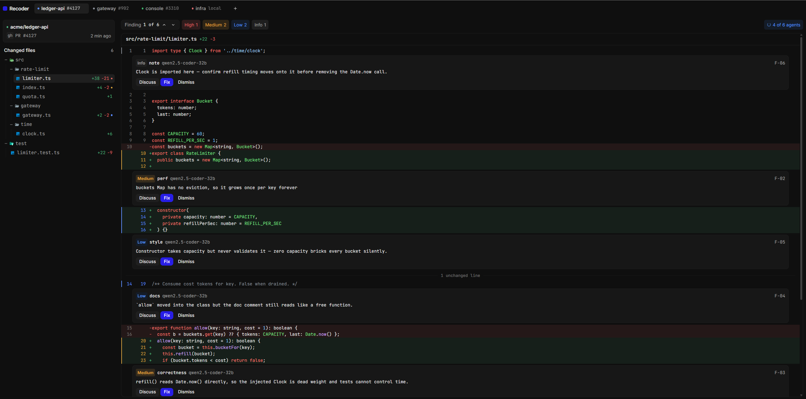

# Recoder

Self-hosted, OpenCode-style pull request reviewer. Runs anywhere Docker runs.



## Quickstart

```sh
bun install
bun run dev        # web on :5173, server on :3001 (turbo runs both)
```

Or fully self-hosted:

```sh
cp .env.example .env
docker compose up --build
# web -> http://localhost:3000, api -> http://localhost:3001
```

## PR fetching & sandboxes

Queued reviews fetch live PR data through the `gh` CLI (metadata + unified
diff), then check the PR head out into an isolated sandbox:

```
$RECODER_WORKDIR/repos/<owner>__<repo>__pr-<n>/
```

- Public repos work with no auth; private repos need `GITHUB_TOKEN` (or `gh auth login`).
- Without `gh`/auth the pipeline keeps working in **stub mode** (demo steps, no clone).
- Never executes PR code on the host: review commands run through the allowlisted runner (`RECODER_ALLOWED_COMMANDS`), and tokens are never embedded in clone URLs (they would leak into run logs).

## Reviewer harness (custom, read-only)

No OpenCode/agent-execution here — a purpose-built orchestrator inventories the
local checkout, plans a bounded set of scoped specialists, and consolidates
their candidates. Agents cannot execute repository scripts, install
dependencies, or modify code.

- Any OpenAI-compatible endpoint: vLLM, OpenRouter, or DashScope. Configure
  `RECODER_REVIEW_BASE_URL` + `RECODER_REVIEW_API_KEY` + `RECODER_REVIEW_MODEL`
  (e.g. a Qwen coder model), with optional per-role overrides
  (`RECODER_SECURITY_MODEL`, `RECODER_PERF_MODEL`, …).
- Planning uses the correctness model. Specialists keep their per-role models.
- Executable PRs always get correctness and repository consistency (`patterns`).
  Other roles are selected by relevance. At most six initial assignments, two
  follow-ups, and two specialists at a time.
- Specialists retrieve evidence through a validated JSON action loop
  (`listFiles`, `readFile`, `search`, `readDiff`) against revision aliases
  (`head`, `target`, `mergeBase`). No shell, no symlink following, no submodules.
- Findings stay candidates until consolidation. Coverage is tracked per changed
  hunk. A finished review is labeled “Review complete”, not a merge approval.
- Progress streams over SSE: `GET /api/reviews/:id/events`.
- Model settings live behind the gear icon (or `PUT /api/settings/models`);
  stored in `$RECODER_DATA_DIR/review-config.json` (0600), overriding env.
- Without model config, queueing a review is refused. The in-app demo route is
  the only stub review path.

## Auth persistence

### ChatGPT subscription reviewers (Codex)

Open **Reviewer models → Codex subscription → Connect ChatGPT**. Open the
official sign-in link and enter the displayed device code yourself. Once
connected, choose an available model (Luna is preselected only if Codex returns
it) and click **Add reviewer model** — it becomes the shared model
automatically (assign it to specific roles instead if you prefer).
Existing role overrides are not changed automatically.

The API server needs Codex CLI 0.153.4 or newer on its PATH. The Docker image
includes a pinned CLI; rebuild the server image to get this integration. For a
local install, run `npm install -g @openai/codex@0.153.4`. A nonstandard binary
can be selected with `RECODER_CODEX_BIN` (an executable path, not a command line).

Recoder starts the official `codex app-server` over private stdio. Codex owns
device sign-in, token storage, and refresh in `$RECODER_DATA_DIR/codex` (directory
mode 0700), backed by the existing data volume. It does not read your personal
Codex login or send OAuth tokens to the frontend. Disconnect affects only
Recoder's login, and requires active Codex calls to finish first.

This provider uses your subscription allowance and reports available usage
windows in settings. It does not switch to an API key, another model, or a
paid API endpoint on failure. Account limits and model access still apply.
Recoder retains orchestration and bounded evidence retrieval; Codex runs as a
text-only adapter with execution features disabled, an empty working directory,
read-only sandbox policy, no turn environments, and no command approvals.
Discussion replies on this provider currently arrive as a complete answer.

Use this single-user server only on a trusted network or behind an authenticated
reverse proxy. Subscription status routes reject unrelated browser origins;
set `FRONTEND_URL` to the actual frontend origin when deploying. This is not a
multi-tenant OAuth application. Login may need to be repeated after provider
revocation or an unrefreshable expiration; restarting Recoder does not log out.

Protocol: [Codex App Server](https://learn.chatgpt.com/docs/app-server).

### GitHub and GitLab

UI-connected provider tokens persist to `$RECODER_DATA_DIR/tokens.json`
(0600, same tradeoff as the gh CLI's own storage) so reconnects survive
restarts and hot reloads. The default directory is `~/.recoder/data`,
independent of the server's working directory. Tokens stay saved until explicitly
disconnected; expired or revoked tokens must be replaced. Saves are atomic, and
failed saves return an error. Process env (`GH_TOKEN`/`GITLAB_TOKEN`) takes precedence when set.
Backed by the `recoder-data` volume in compose.

GitHub and GitLab reviews fetch PR/MR metadata, clone into a separate checkout
per review, and compute the merge-base diff with local Git. They do not use
GitHub's size-limited PR diff endpoint. The checkout retains the reviewed head
SHA, fetched target-branch SHA, and merge-base SHA. Repository conventions are
read from the target revision; old behavior is compared at the merge base.
Checkouts are read-only inputs to the review harness, not OS-level containers.
Model inference still uses the endpoint configured in settings. Live provider
failures fail the review instead of silently succeeding with a stub.

## Durable state (SQLite)

Tracked repos, reviews, command runs, and fetched diffs live in
`$RECODER_DATA_DIR/recoder.db` (WAL mode) — restarts and hot reloads no
longer wipe sessions. Reviews orphaned mid-run by a restart are marked
failed on boot with a retry hint instead of spinning forever.

## API (server :3001)

| Method | Path                    | Description                              |
| ------ | ----------------------- | ---------------------------------------- |
| GET    | `/health`               | liveness probe                           |
| GET    | `/api/repos`            | list tracked repos                       |
| POST   | `/api/repos`            | track a repo `{ name, url }`             |
| DELETE | `/api/repos/:id`        | untrack a repo                           |
| GET    | `/api/auth/status`      | gh/glab availability + auth state        |
| POST   | `/api/auth/token`       | validate + store a PAT `{provider,token}`|
| DELETE | `/api/auth/token/:provider` | forget a stored PAT                  |
| GET    | `/api/auth/repos?provider=` | your repos on a provider             |
| GET    | `/api/reviews`          | list reviews                             |
| POST   | `/api/reviews`          | queue a review `{ repoId, prNumber }`    |
| GET    | `/api/reviews/:id`      | review detail (status, findings, runs)   |
| GET    | `/api/reviews/:id/files`| parsed unified diff (404 until fetched)  |
| GET    | `/api/runs` `/runs/:id` | command run logs                         |
| POST   | `/api/webhooks/github`  | GitHub `pull_request` webhook (HMAC)     |

## Layout

```
apps/web        SvelteKit frontend (adapter-node, self-hostable)
apps/server     Bun API + gh fetching + sandboxes + command runner
packages/shared shared API types + unified-diff parser
```

## Environment

| Var                          | Default                    | Purpose                        |
| ---------------------------- | -------------------------- | ------------------------------ |
| `PUBLIC_API_URL`             | `http://localhost:3001`    | web → api (browser)            |
| `FRONTEND_URL`               | `http://localhost:3000`    | server links/CORS              |
| `PORT` / `HOST`              | `3001` / `0.0.0.0`         | server bind                    |
| `GITHUB_TOKEN`               | (unset)                    | `gh` auth for private repos    |
| `GITLAB_TOKEN`               | (unset)                    | `glab` auth (or connect in UI) |
| `GITHUB_WEBHOOK_SECRET`      | (unset = accept unsigned)  | webhook HMAC                   |
| `RECODER_ALLOWED_COMMANDS`   | `echo,git,gh,bun`          | command runner allowlist       |
| `RECODER_WORKDIR`            | `/tmp/recoder-work`        | sandbox checkouts + run cwd    |
| `RECODER_COMMAND_TIMEOUT_MS` | `120000`                   | per-command timeout            |

## UI

SvelteKit + Tailwind CSS v4 + [Sivir UI](https://sivir.dev) (`@sivir-ui/svelte`,
Midnight Ledger theme). Per the [Sivir guide](https://sivir.dev/llms.txt), check
the live component pages before adding new components.
