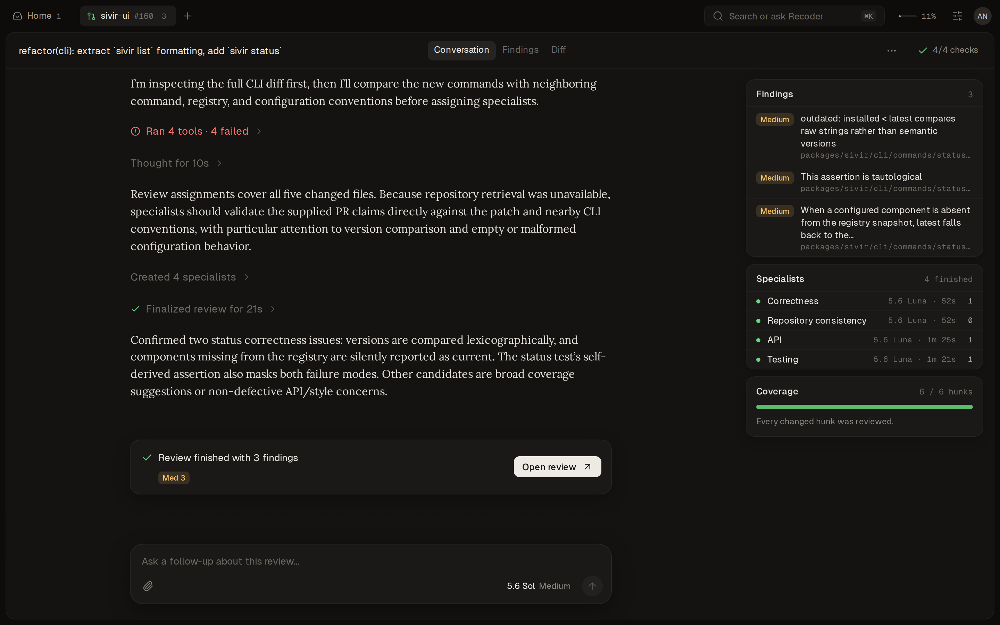

# Recoder

A self-hosted pull request reviewer.



## Run

```sh
bun install
bun run dev
```

The app opens at http://localhost:5180 and the server listens on port 3001. `bun run dev:web` runs the SvelteKit app (`apps/web`) in its place.

Or with Docker:

```sh
cp .env.example .env
docker compose up --build
```

The app opens at http://localhost:3000 and the server listens on port 3001. The image builds `PUBLIC_API_URL` into the app, so rebuild after you change it.

Configuration lives in [`.env.example`](.env.example).

For multiple API replicas, configure shared PostgreSQL storage. See [HA operation and migration](docs/ha-operating.md).

Recoder can review pull requests on its own when someone comments `@recoder` on them: see [docs/auto-review.md](docs/auto-review.md).

The review pipeline is documented stage by stage for agents in [docs/review](docs/review/README.md).

You can run the same review from a terminal with the `recoder` command: `recoder init` sets it up for your coding agents, and `recoder review` prints the report where you work. Agents pass `-p` for JSON, or use the MCP tools of `recoder mcp`. None of it needs the server: see [docs/review/cli.md](docs/review/cli.md).
